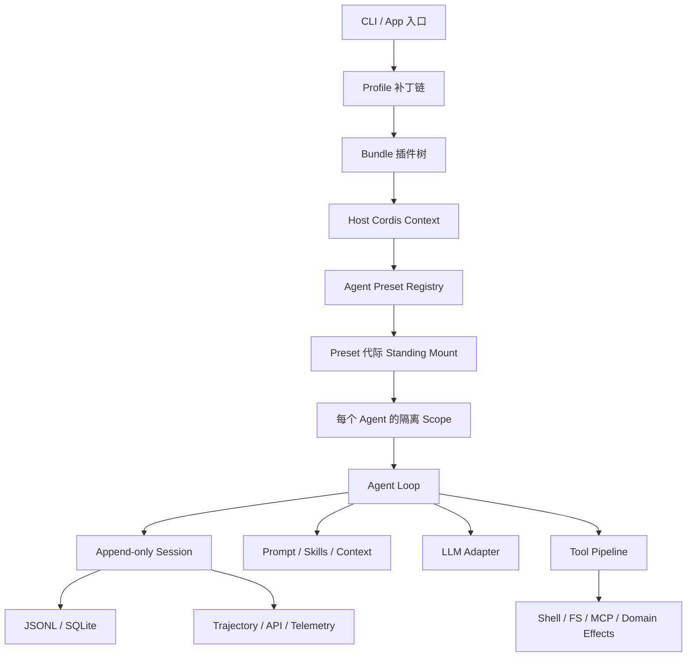
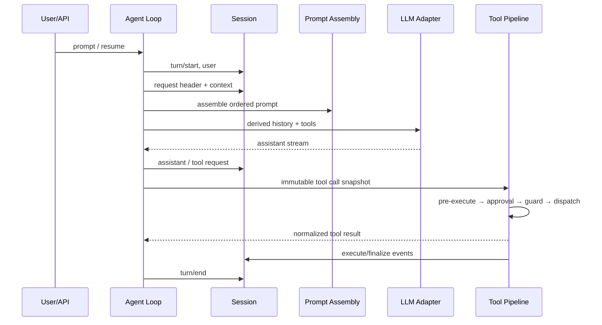

# DeepSeek Harness 源码全面分析与解构

## 文档定位

本文是基于仓库提交 `47f943859bef60e4160492346772ded9b24f765a`、版本 `0.1.0-rc.5` 的中文源码审查报告，面向需要理解架构边界、运行语义、工程成熟度与采用风险的维护者和技术负责人。

本文所称“全面”是指对仓库自有代码进行全量结构、清单、包元数据、README、不变量、依赖关系与测试分布扫描，并对启动、组合、会话、Agent 循环、工具、持久化、沙箱、交互、远程接口和四种模式的关键路径逐段深读；它不等同于对 22 万余行生产 TypeScript 的逐行形式化证明，也不包含真实模型调用、压力测试、故障注入或目标硬件验证。

`vendor/` 是仓库固定的上游分叉依赖，本次仅审查其版本锁定、修改说明与本项目集成边界，不把第三方源代码计入自有代码质量结论。自动生成的包、配置、工具、事件和持久化目录以现有生成文档为事实源，本文只给出解释与交叉链接，避免形成第二份会漂移的清单。

相关交付包括[新能源功率软件工程开发指南](./power-software-engineering-guide.md)和[可扩展性分析与插件开发指南](./plugin-extensibility-guide.md)。

## 结论先行

DeepSeek Harness 不是围绕一个中心 `Agent` 类堆叠功能，而是由 Cordis 上下文、服务、事件和可释放副作用构成的可组合运行时；“一切皆插件”在源码层面成立，且同时存在宿主 Profile/Bundle 与 Agent Preset 两个组合平面。

会话事件流是系统的事实主干：模型请求前的上下文、模型回复、工具调用、子 Agent 与内部调度都以追加事件表达，派生消息、恢复、分叉、回放和 UI 投影共享该序列。其优势是可追溯和可重建，代价是事件模式、顺序、隐私、写入持久性和兼容策略成为全局性约束。

工具系统的真正扩展点不是“注册一个函数”，而是 `Definition → Provider → Consumer` 服务缝、作用域所有权、审批/守卫/事件瀑布链和会话记录的组合。插件必须遵守发布后可用、卸载后无残留、瀑布事件继续委托、模型可见信息先落会话等不变量。

工程基础质量较强：219 个包均具有包级 README、中文 README、`src/invariant.ts` 与统一版本；216 个包具有本地测试；包源文件采用逐文件 100% 覆盖门禁；构建刻意分离 Host 和 Client 类型世界；配置目录和能力目录由测试生成并校验。

当前仍是预发布架构。主要采用风险不是缺少功能，而是信任边界容易被名称误读、部分远程/持久化能力仍以本机单用户为假设、固定 Cordis 分叉增加升级成本、Preset 热重组存在代际回收与文档漂移、少数核心文件体积过大，以及尚无后端吞吐、延迟、长时间运行和故障恢复的量化验收基线。

【工程判断】它适合充当可审计的通用 Agent 编排底座和内部工程工作台，但若进入新能源量产研发、真实设备调试或多租户服务，必须在 Harness 外再建立设备执行网关、精确授权、凭据隔离、审计脱敏、幂等/读回和物理安全链，不能把 Node.js 沙箱、模型审批或会话取消等同于功率级安全机制。

## 审查基线与规模

| 项目 | 扫描结果 | 含义 |
| --- | ---: | --- |
| 跟踪文件 | 7,412 | 单仓库、细粒度包与较完整文档资产 |
| `packages/<group>/<package>` 包 | 219 | 49 个能力分组 |
| 自有生产 TS/TSX | 1,386 个文件，约 228,300 行 | 不含测试、构建产物与 `vendor/` |
| 测试 TS/TSX | 854 个文件，约 268,040 行 | 测试代码规模高于生产代码 |
| Apps | 106 个文件，约 23,852 行 | CLI、Web 与集成入口 |
| 包内测试 | 216/219 | 例外是定义型、示例型和极小品牌工具包 |
| 内部运行/Peer 依赖图 | 219 个节点，1,293 条边 | 不计 `devDependencies`；服务定义包形成大量共享入边 |
| 版本与运行时 | `0.1.0-rc.5`；Node `^22.19 || >=24`；pnpm `11.7.0` | 明确处于 RC，工具链要求较新 |

本次不计 `devDependencies` 的运行/Peer 依赖图只有一个多节点强连通分量，位于 `api-gateway → api-remotes → client-connection → host-apiproxy`。pnpm 的全工作区安装还报告 `sandbox-local ↔ sandbox-windows-acl`、`subagent-spawn-in-process ↔ tool-subagent` 和 Cordis vendor/include 环，其中前两组反向边来自测试用 `devDependencies`。API 环与 Host/Client 双类型面、远程契约生成和传输桥接有关，不能仅凭环判定为缺陷，但它是升级、构建顺序和接口演进最需要回归测试的耦合热点。

入度最高的包依次包括不变量、会话、LLM、Agent 和工具定义，说明仓库确实围绕少数稳定服务缝组织能力，而不是让所有包互相调用实现细节。

## 总体架构：两个组合平面

第一层是宿主组合平面。CLI 根据 Profile 找到 Bundle，再把 Bundle、Profile、用户目录、命令行覆盖和遥测开关依次折叠成 Cordis 配置树；[`profile.ts`](../../packages/boot/app-boot/src/profile.ts)负责发现和组合，[`profile-boot.ts`](../../apps/cli/src/profile-boot.ts)定义覆盖顺序，[`app-boot`](../../packages/boot/app-boot/src/index.ts)创建根上下文、加载配置树、等待激活并在失败时回滚。

第二层是 Agent 组合平面。[`agent-presets`](../../packages/preset/agent-presets/src/index.ts)把一个 Preset 配置装成可复用的 standing composition，每个 Agent 再以该代际为父级创建自身作用域。这样，同一宿主可承载不同能力集合的 Agent，Agent 重组也不必重启整台 Host。

两个平面的共同底层是 Cordis。上下文提供作用域和依赖注入，服务提供稳定缝，事件提供协作协议，`ctx.effect()` 把资源创建与卸载绑定。仓库的[架构文档](../../docs/architecture.zh.md)明确不存在一个拥有特权的“大内核”；约束来自服务、事件、作用域和插件生命周期的组合。

## 宿主启动与配置覆盖

默认模板把 `web` Profile 组合为 `base + web-app`，把 `headless` 组合为 `base + headless`。Profile 元数据保存在 `$DSH_HOME/profiles`，Bundle 通过包清单中的 `dsh.bundle` 暴露配置补丁。

实际覆盖顺序为 Bundle 基线 → Profile 补丁 → Home 补丁 → 临时 overlays → 遥测开关。补丁语义是对配置条目的结构化变换；某些配置更新会替换整个 `config` 字段而不是深合并，因此覆盖者必须重述需要保留的兄弟字段。

启动过程具有事务式意图：先准备 Loader 和 Host 上下文，再挂载根 include，等待所有配置条目进入激活态；任一条目失败会释放已建立的局部树。这个设计避免“进程已启动但能力只激活了一半”的静默状态。

CLI 插件管理器本质上是 pnpm 的薄封装；安装后，只要依赖包声明 `dsh.bundle` 就会加入 Profile 组合。这里没有插件签名、来源鉴别或进程级权限隔离，因而【已验证事实】第三方 Bundle 与本进程具有同等代码执行信任。

## Agent Preset、作用域与重组

Preset 是 `preset.yml`、`agent.cordis.yml` 及可选技能/资产的组合。系统为每个文件戳代际做 single-flight 挂载，避免并发 Agent 重复建立同一代配置；子 Preset 会加入父 Preset 的精确代际，以保持一个组合内部的一致性。

[`mount.ts`](../../packages/preset/agent-presets/src/mount.ts)在发布前等待插件树稳定，拒绝非激活条目，并检查 Preset 服务是否泄漏到根 Realm；挂载失败会回滚。Preset 要提供服务时必须经过 isolate，这一约束是多 Agent 并存不相互污染的关键。

重组先建立新 standing generation，再把 Agent 作用域重新绑定到新父级。当前实现刻意保留旧代组合，以免仍在运行的 Agent 被提前拆除；但是旧代没有回收机制，长时间频繁编辑会积累资源。当前组合戳只看主要配置文件的修改时间和大小，技能或资产内容变更不一定触发新代。

【已验证事实】[Preset 英文 README](../../packages/preset/agent-presets/README.md)仍描述“卸载旧子树后挂载新子树”，而实现保留旧代并重绑父级；这是语义级文档漂移，应以实现和测试为当前事实，并在发布前修正文档及增加代际回收测试。

用户 Preset 的“可信”标识只用于展示，不是沙箱。仓库文档明确指出用户 Preset 与 Shell 具有相同信任，因此它不能作为租户边界。

## 四种运行模式

| 模式 | 实际 Preset 组成 | 适用场景 | 必须避免的误解 |
| --- | --- | --- | --- |
| Standard | 29 个配置条目，完整编码工具、技能、规划、子 Agent 等 | 日常工程 Agent | “标准”不代表最小权限 |
| Code/PTC | 30 个条目，在 Standard 近似集合上增加代码工具呈现 | 由模型生成代码编排多次工具调用 | Worker Thread 不是安全容器，子调用副作用不回滚 |
| Minimal | 8 个条目，模型侧主要保留 persistent bash 与 `str_replace` 编辑器 | 基准、最小工具面 | “极简”只表示能力面小，不表示低信任或文件受限 |
| Cordis/Creator | 30 个条目，增加运行时 Cordis 工具及配套技能 | 内存中试验、创作组合 | VM 和浏览器执行面都不是安全边界 |

Minimal 的本地文件服务 `cwd` 是路径解析默认值而非 containment root；绝对路径和 `..` 可以越出工作目录。Shell 会经过宿主沙箱策略，但编辑器本身没有因此获得目录围栏。因此【已验证事实】Minimal 不能用于承诺“只可修改工作区”的场景。

Code 模式的每个 SDK 子调用仍穿过完整工具管线并写入 `tool/code-dispatch-start` 和 `tool/code-dispatch` 会话事件，这是可审计性的优点。限制是中间值没有独立字节上限，只有外层输出上限；外部副作用也没有事务回滚。

Creator 的动态 Cordis 代码在 VM 中试验，但异步操作可越过同步 VM timeout，且创建的组合可影响同进程其他会话；浏览器半边在没有页面或页面不响应时也缺少统一截止机制。它应按“拥有 Bash 等级信任的开发工具”运营。

## 一次 Turn 的真实数据流

[`agent.ts`](../../packages/core/agent-loop/src/agent.ts)在模型分派前写入请求头和上下文，再从会话派生模型历史。这使“模型看到的一切都能追溯”成为实现顺序，而非仅是日志旁路。

系统提示由有序 section、作用域遮蔽和严格插值组成，能力插件通过事件瀑布参与装配。Minimal 可选择 complete prompt，抑制运行时上下文拼接。瀑布处理器若不继续调用 `next`，会截断后续贡献者，因此它是一个需要合同测试的高影响扩展点。

LLM 层通过适配器注册和路由解析选择后端，捕获确定路由后再开始流式规范化；重试是独立策略插件。这个分层允许替换供应商，但模型内容、重试幂等性、计费和故障归因仍需由组合者统一约束。

## 会话：追加事件是事实主干

[`types.ts`](../../packages/core/session/src/types.ts)定义 `SESSION_FORMAT_VERSION = 0`，Header 包括会话 ID、工作目录、父会话、seed、委托和 Preset 等元数据。未知事件只有显式标记 `ignorable: true` 才能安全跳过。

[`session`](../../packages/core/session/src/index.ts)为事件分配连续序号，校验 lossless JSON 表面，禁止重入 append，并在通知受控观察者前提交到内存序列。模型消息不是另一份独立数据库，而是从该事件序列投影而来。

会话 Store 的生命周期是 create/prepare/enter/announce，flush 会等待各持久化参与者 settle。Fork 只复制稳定前缀，不能在开放 Turn 的不完整位置结束。这些约束保证恢复与分叉共享同一语义。

优点是审计、回放、UI、恢复和遥测有同一个事实源；风险是事件兼容、顺序和脱敏必须跨所有生产者保持一致。当前格式仍是 v0，存储后端没有迁移框架和删除语义，不能在外部合规要求明确前假设长期格式稳定。

## 工具管线与策略边界

[`tools`](../../packages/core/tools/src/index.ts)支持 native、code 或两种呈现。注册表、限制、守卫和可见工具均可作用域化；守卫只能收紧权限，避免下游重新放宽上游策略。

执行时先冻结工具名和参数快照，再依次经过 pre-execute、用户审批、guard、dispatch、`tools/execute`、post 和 finalize，最终返回不可变结果。缺少审批回答者时需要审批的调用 fail closed，工具输出还会接受 JSON 表面校验。

[`user-approval`](../../packages/interaction/user-approval/src/index.ts)的请求包含工具名、理由和 call ID，但刻意不携带完整参数。因此通用“允许一次”无法让操作者确认诸如目标板序列号、寄存器地址、文件路径和功率条件等关键细节。对于高风险工具，必须在领域层增加基于完整规范化参数的授权票据，不能只复用通用审批。

取消是协作式的：Harness 会传播取消信号并等待工具 Promise 静止，但无法证明已经启动的子进程、网络端操作或物理动作停止。任何可产生外部效果的工具都要自己实现超时、停止、读回和未知结果分类。

## 持久化与中断恢复

[`session-persistence`](../../packages/session/session-persistence/src/index.ts)把会话写入抽象成定义、协调器、准备阶段和 write-behind。JSONL 后端默认使用 zstd、执行 fsync、初始发布不覆盖现有会话，并在部分追加失败时回滚；同一会话只允许一个活跃 writer，且没有删除能力。

[`SQLite 后端`](../../packages/session/session-persistence-sqlite/src/index.ts)基于同步 `DatabaseSync`，简单直接但会阻塞 Node 事件循环；当前没有 busy timeout、竞争重试、迁移与删除机制。它适合本机单进程基线，不应未经压测直接外推为多进程服务存储。

恢复逻辑会把被中断工具区分为 `TOOL_NOT_STARTED` 与 `TOOL_OUTCOME_UNKNOWN`。后者的正确动作不是盲目重试，而是仅对只读/幂等操作重试，或先对外部系统做读回确认。

Schedule 在执行前依赖持久化屏障，并把计划状态写入会话；但是“外部效果已发生、完成事件尚未持久化”仍形成重复执行窗口。它适合至少一次语义的本机计划，不适合直接驱动要求 exactly-once 的设备动作。

## 能力分层与主要子系统

仓库目标依赖方向可归纳为应用/组合 → 控制域与服务 → Provider/驱动 → 运行时基础。实际包组织不是传统分层目录，而是按能力域分组，再由 Definition 包提供向内依赖的稳定接口。

| 能力域 | 代表实现 | 架构作用 |
| --- | --- | --- |
| Core | `agent`、`agent-loop`、`session`、`tools`、`llm` | Turn、事件事实源、工具与模型抽象 |
| Boot/Preset/Bundle | `app-boot`、`agent-presets`、`bundle-*` | 两层组合与模式装配 |
| Prompt/Skill/Context | prompt sections、skills、workspace、compaction | 模型上下文与能力呈现 |
| Tool/Interaction | shell、fs、LSP、MCP、approval、question | 外部能力和人机协同 |
| Session/Storage | JSONL、SQLite、search、trajectory、telemetry | 恢复、检索、投影与导出 |
| Delegation/Execution | subagent、jobs、workflow、schedule、code runtime | 并发工作与长期执行 |
| Host/API/UI | webserver、ApiProxy、Typert、Web UI、ACP、SDK JSON-RPC | 操作面和远程契约 |
| Policy/Sandbox | sandbox policy、平台后端、tool guard | 文件策略与执行约束 |

完整包、配置、工具、事件生产者和持久化映射应查看[模块图](../../docs/module-graph.zh.md)、[配置目录](../../docs/config-catalog.zh.md)、[工具目录](../../docs/tool-catalog.zh.md)、[事件生产者与消费者图](../../docs/event-producer-consumer.zh.md)和[持久化目录](../../docs/persistence-catalog.zh.md)。

## 外部接口与 UI

Web Host 使用 Node HTTP、连接管理、ApiProxy 与 Typert 生成的远程契约；Host 和 Client 被拆成两个 TypeScript 聚合项目，是因为相同 Cordis 服务键在两端具有不同声明面。除 `api/remotes` 的桥接外，不应让浏览器代码直接导入 Host 实现。

当前 Web Server 可以监听 `127.0.0.1` 或 `0.0.0.0`，但没有内建 TLS、身份认证和 Origin 安全模型。Host fence 约束的是可达性，不是身份。将它暴露到远程网络前需要反向代理、强身份、授权、CSRF/Origin、速率限制和错误脱敏。

ACP 是基于 stdio 的 JSON-RPC 自动化入口，当前偏向创建新的文本会话，没有等价覆盖恢复、分叉和全部 UI 操作，也没有网络认证问题。SDK JSON-RPC 同样通过 stdio 服务 TS/Python 客户端，缺少协议版本协商、取消和显式 session close；其高层“结果”更多是活动静默窗口的推断，不是与某个 prompt 严格因果绑定的提交凭证。

Python bundled runtime wheel 覆盖 Linux x64/arm64 和 macOS arm64，不覆盖 Windows。跨平台集成需要把这一点纳入安装器和 CI 矩阵，而不是仅依赖 Node 主程序的 Windows 支持。

Trajectory UI 提供按来源查看会话事件的核心价值，但相关表格组件超过 3,000 行，是前端可维护性热点。Host ApiProxy 单文件超过 3,700 行，是后端接口耦合热点；后续拆分应围绕稳定远程契约与行为测试渐进进行，不能为了文件尺寸跨层重构。

## 测试、构建与文档工程

包级源码实行逐文件 100% 覆盖门禁，而不是只看仓库平均值。关键产品能力要求使用真实 Loader 和应用组合做 E2E；真实模型 API 测试按密钥门控，另有无密钥快照；Web 使用 Chromium 快照。

构建顺序先编译 Host，再由 Host 构建和 Typert 生成远程契约，然后编译 Client，最后构建 Web。这一顺序是双类型面架构的一部分，不能把普通 monorepo 并行构建规则直接套用。

仓库通过 TypeScript source resolution 避免测试误读陈旧 `lib/` 产物。每个包都有 README 和 invariant，文档目录中的能力清单由测试生成。这个机制显著降低“源码已改、目录未改”的漂移概率。

现有可选前端性能脚本覆盖 1,000 个侧栏会话、500 Turn 历史和 100 Turn soak，但只报告数据，没有时间断言。仓库没有已发现的后端吞吐、尾延迟、内存上限、事件日志膨胀、SQLite 竞争或恢复时间 SLO，因此不能声称具备确定性能。

## 安全与信任模型

【已验证事实】当前 sandbox policy 的统一词汇主要约束文件系统操作，不等同于网络、进程、系统调用、设备、USB/J-Link、串口或凭据隔离。Bubblewrap、Landlock、Seatbelt 和 Windows ACL 后端的能力也不完全等价，平台降级必须明确呈现。

【已验证事实】Code Worker 清空环境并具备墙钟、活跃时间、输出和堆限制，但 Worker Thread 与宿主共享进程级信任，终止 Worker 不保证其创建的 OS 子进程已经结束。Creator VM 同样不是安全边界。

【已验证事实】遥测默认关闭；若设为 `FULL` 或 `FEEDBACK_ONLY`，完整事件可能包含 prompt、用户/助手内容、工具参数/结果、命令、文件内容和工作目录。默认插件没有通用脱敏器，生产导出前必须增加字段级筛选。

【代码推断】Web API 的错误细节和会话搜索 Provider 详情在外部部署时可能泄露内部路径、查询或后端信息；源码中已有待脱敏注释，说明当前边界按本机可信用户设计。

【工程判断】插件安装、用户 Preset、Shell、Code 与 Creator 应统一归入“完全信任代码”层级；工具审批和文件沙箱只能是纵深防御，不能把不可信租户安全地放进同一 Host。

## 风险清单与优先级

| 级别 | 发现 | 触发场景与影响 | 建议动作 |
| --- | --- | --- | --- |
| P0（场景相关） | 名称造成错误安全预期：Minimal、Sandbox、Approval、VM 均不是完整隔离 | 多租户、真实设备、秘密材料或远程暴露时可能越权或产生不可逆效果 | 在产品 UI 和 Profile 清单标注信任等级；高风险能力拆到独立进程/网关 |
| P0（功率场景） | 取消、重试、Schedule 都不能提供物理动作 exactly-once 或已停止证明 | 烧录、擦写 NVM、PWM、继电器、接触器等动作可能重复或结果未知 | 领域网关实现命令 ID、前置状态、幂等、读回、硬件联锁和人工任务授权 |
| P1 | Web 监听可外放但无内建认证/TLS/Origin | `0.0.0.0` 暴露后形成未授权控制面 | 默认只监听 loopback；远程模式经认证代理并加入威胁模型和集成测试 |
| P1 | 遥测与追加日志可含高敏原文且无内建删除 | 凭据、源码、设备信息进入长期存储或外部 Collector | 默认最小事件集、字段脱敏、加密、保留期和合规删除方案 |
| P1 | Session format v0，JSONL/SQLite 无迁移/删除 | RC 升级或长期留存时兼容和合规受阻 | 发布前定义版本策略、只读旧版、迁移、备份与回退测试 |
| P1 | Cordis 与多个依赖使用固定 RC 分叉 | 上游升级、安全修复或 Node 变化时维护成本集中 | 记录补丁账本、上游差异 CI、固定兼容矩阵和逐补丁退出计划 |
| P1（当前环境） | Esafenet 对部分文件的解密不透明于 Node 直读 | Node 测试/脚本可能读取加密容器而产生假失败，受影响文件范围尚未量化 | 使用获批的明文构建/CI 工作区或配置进程解密；本地检查按要求使用 PowerShell `Get-Content` |
| P1 | Preset 重组保留旧代且不回收 | 频繁编辑、长寿命 Host 造成内存/句柄累积 | 引用计数或租约回收；加入 soak 与资源释放断言 |
| P1 | Preset README 与当前重组实现不一致 | 插件作者按旧语义释放资源，导致悬挂或提前关闭 | 修正文档，补充 old/new generation 并存合同测试 |
| P1 | Code 子调用中间值无独立上限 | 大工具结果组合导致 Worker/Host 内存压力 | 为每次 subdispatch 和累计工作集设置上限并提供 spill 句柄 |
| P2 | SQLite 同步且无 busy timeout/retry | 高并发写入阻塞事件循环或报锁竞争 | 测量后选择单写入队列、busy timeout 或异步/外置 Provider |
| P2 | 核心 ApiProxy、Trajectory、工具注册等单文件过大 | 接口演进冲突、审查困难、局部回归范围扩大 | 以已有契约测试为护栏按能力域抽取，不改变公共 API |
| P2 | API 环形成唯一多包 SCC | 构建、类型生成和升级顺序脆弱 | 保持双面契约的单一生成源，增加环边界和版本协商测试 |
| P2 | Web HMR 当前禁用 | Web 插件开发反馈周期与宿主配置 HMR 不一致 | 修复已记录 patch 问题后恢复，并测试卸载无残留 |
| P2 | Host gateway 仍报告占位版本 `0.0.1` | 客户端诊断与兼容判断失真 | 从统一构建版本注入，加入非占位断言 |
| P2 | `timeout-policy` 有首发前重命名 FIXME | 发布后再改会形成包名兼容债 | 第一个正式 tag 前完成或明确冻结名称 |
| P3 | persistent bash 超时文本把 timeout 与 OOM 混写 | 用户诊断错误 | 按真实终止原因分别呈现 |

P0 标记不是说当前本机开发模式已经发生事故，而是表示一旦进入相应部署或功率执行场景，该问题会直接破坏安全不变量，必须在启用场景前解决。

## 成熟度评价

| 维度 | 评价 | 依据 |
| --- | --- | --- |
| 架构可组合性 | 强 | 两层组合、服务缝、作用域、事件和可释放副作用一致贯彻 |
| 能力广度 | 强 | 模型、工具、技能、上下文、子 Agent、任务、计划、UI、存储、协议均可替换 |
| 可追溯性 | 强 | 模型可见内容和执行活动围绕统一会话流 |
| 单元与组合测试文化 | 强 | 测试规模、逐文件覆盖、真实 Loader 组合门禁 |
| API/数据稳定性 | 早期 | 全仓 RC、Session v0、远程协议缺少版本协商 |
| 多租户安全 | 弱/非目标 | 全信任插件、本机 Web 假设、沙箱范围有限 |
| 长期运行与容量证据 | 待补 | 缺少后端压测、SLO、资源代际回收证据 |
| 功率控制实时性 | 不适用 | Node/LLM Harness 不是 MCU/DSP 实时控制器 |

## 推荐采用路径

第一阶段用于离线、只读和可回滚工程任务：源码理解、构建、静态分析、日志/波形解析、测试生成、文档与仿真。保持 Web loopback、遥测关闭、插件白名单和工作区级凭据隔离。

第二阶段接入内部工具时，为每个领域能力建立 Definition/Provider/Consumer 服务缝，使用专用 Profile 隔离高权限工具，并补齐完整参数授权、超时、取消后静止、幂等、读回和事件脱敏合同。

第三阶段若需要团队服务化，先解决身份、租户、秘密、日志保留、协议版本、持久化迁移、容量 SLO 和插件供应链，再考虑远程开放。不要直接把本机 Web Host 绑定公网。

第四阶段才考虑真实设备操作，且 Harness 只负责意图编排与审计，独立设备网关负责唯一物理执行、状态许可、硬件联锁和安全停止。详细边界见[新能源功率软件工程开发指南](./power-software-engineering-guide.md)。

## 已知未知项与验收建议

【未知项】真实生产组合的典型会话长度、并发 Agent 数、工具结果尺寸、SQLite/JSONL 写入量、Web 客户端数量和遥测 Collector 拓扑尚未给出，因此不能推导容量。

【未知项】未提供威胁模型、数据分级、保留期限、插件供应链策略和远程部署方案，因此安全评价以“本机可信单用户”基线为限。

【未知项】未执行真实 LLM、MCP、ACP、浏览器和跨平台沙箱 E2E；这些需要相应凭据、平台和外部服务。

发布或组织级采用前，建议增加以下量化门禁：

- 以真实生产组合测量启动、首 Token、工具调用、会话 append/flush、恢复和分叉的 p50/p95/p99。
- 对 1、10、100 个并发 Agent 做 24–72 小时 soak，观察旧 Preset 代际、Worker、子进程、文件句柄和堆增长。
- 对写入中断、磁盘满、SQLite 锁竞争、进程 kill、工具结果未知和重复 Schedule 做故障注入。
- 对所有远程入口做认证、授权、Origin、速率、错误脱敏和事件隐私测试。
- 对每个高风险领域工具做参数级审批、重复请求、超时后读回和“外部已成功但本地未记账”测试。

## 本次文档验证结果

锁定依赖使用 Node 24.15.0、Corepack pnpm 11.7.0 和 `--frozen-lockfile` 完整安装；默认 npm 镜像首次下载超时后改用官方 registry 续装，最终安装退出码为 0，锁文件未变化。

聚合 `pnpm run doc-sync` 的 28 项门禁中 26 项通过，包括文档代码块类型检查、Cordis/Client/Tool/Config/Persistence 目录一致性、文档图和事件生成一致性、Markdown 换行/链接、源码引用、包路径、Mermaid、翻译配对、文档预算、README 合同和 VitePress 文档站构建。

两项未通过均未修改对应源码：`verify-translation-prompt` 在独立复跑时仍以“missing or unterminated <translation> section”失败，进一步诊断确认其 Node `readFileSync` 读取到带 `Esafenet` 标记的加密容器，而按本环境要求使用 PowerShell `Get-Content` 能读出含完整三段 XML 的明文，因此这是加密工作区与 Node 直读路径的环境兼容问题，不能据此判定 Prompt 合同有缺陷；`project-doc-site.spec.ts` 的 43 个测试中 42 个通过，剩余用例因当前 Windows 账户无创建测试 symlink 的权限而报 `EPERM`，文档站构建本身通过。

三份报告还单独通过 `verify-md-wrap`、`verify-md-links`、`verify-mermaid`、`verify-translation-pairing`、`verify-doc-budgets`、`verify-public-repository-links`、`verify-doc-refs` 和 `verify-package-paths`；对三份未跟踪报告逐文件运行 `git diff --no-index --check` 未发现空白错误。未运行完整产品构建、全量单元/覆盖率、真实模型、浏览器快照、外部协议或硬件测试。

## 关键源码索引

- 宿主 Profile 与 Bundle：[`profile.ts`](../../packages/boot/app-boot/src/profile.ts)、[`profile-boot.ts`](../../apps/cli/src/profile-boot.ts)、[`boot`](../../packages/boot/app-boot/src/index.ts)
- Agent Preset：[`index.ts`](../../packages/preset/agent-presets/src/index.ts)、[`mount.ts`](../../packages/preset/agent-presets/src/mount.ts)、[`discovery.ts`](../../packages/preset/agent-presets/src/discovery.ts)
- Turn 与会话：[`agent.ts`](../../packages/core/agent-loop/src/agent.ts)、[`session/index.ts`](../../packages/core/session/src/index.ts)、[`session/types.ts`](../../packages/core/session/src/types.ts)
- 工具与审批：[`tools/index.ts`](../../packages/core/tools/src/index.ts)、[`user-approval`](../../packages/interaction/user-approval/src/index.ts)
- 持久化：[`session-persistence`](../../packages/session/session-persistence/src/index.ts)、[`JSONL`](../../packages/session/session-persistence-jsonl/src/index.ts)、[`SQLite`](../../packages/session/session-persistence-sqlite/src/index.ts)
- 沙箱与代码运行时：[`sandbox-policy`](../../packages/sandbox/sandbox-policy/src/index.ts)、[`code-runtime-worker-thread`](../../packages/code-runtime/code-runtime-worker-thread/src/index.ts)
- Host 接口：[`webserver`](../../packages/host/webserver/src/index.ts)、[`api-proxy.ts`](../../packages/host/apiproxy/src/api-proxy.ts)
- 测试与文档规范：[测试指南](../../docs/testing.zh.md)、[架构指南](../../docs/architecture.zh.md)、[新增包指南](../../docs/cookbook/adding-a-package.zh.md)、[新增工具指南](../../docs/cookbook/adding-a-tool.zh.md)
