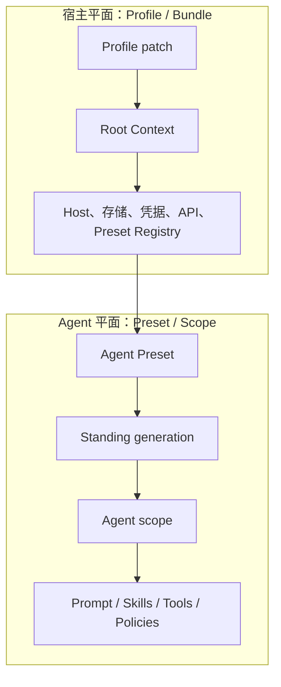
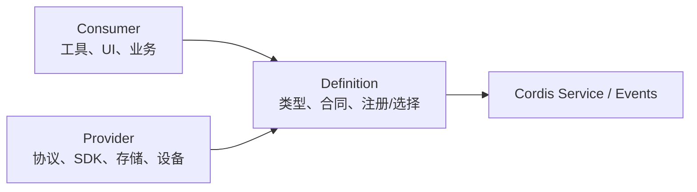

# DeepSeek Harness 可扩展性分析与插件开发指南

## 文档定位

本文同时回答两个问题：DeepSeek Harness 的“一切皆插件”在源码中扩展到了什么程度，以及第三方团队怎样以最小耦合方式开发、测试、安装和长期维护插件。

本文基于版本 `0.1.0-rc.5` 的公开包 API、Cordis 组合规则、Bundle/Preset 实现、工具管线、Host/Client 类型边界与仓库门禁。完整风险背景见[源码全面分析与解构](./deepseek-harness-source-analysis.md)，新能源设备插件的安全边界见[功率软件工程开发指南](./power-software-engineering-guide.md)。

## 结论先行

【已验证事实】模型、工具、技能、Prompt、会话、存储、LLM、子 Agent、任务、工作流、调度、沙箱、设置、凭据、Host API 和 Web UI 都通过 Cordis 服务、事件或插件配置组合；Profile/Bundle 与 Agent Preset 又让能力在宿主和单 Agent 两个平面自由替换。因此“一切皆插件”不是营销层抽象，而是仓库的真实依赖方向。

最强的扩展性来自“空间组合 + 时间组合”：空间上，Definition、Provider、Consumer 可以独立替换；时间上，`ctx.effect()`、Fiber、HMR 和 Preset generation 让能力随作用域装载/卸载。一个合格插件的核心指标不是“能加载”，而是“只有在完整就绪后发布，作用域结束后无资源、服务、事件或模型上下文残留”。

当前外部插件生态的主要约束是全仓仍处 RC、Cordis 使用固定分叉、插件具有宿主进程完全信任、Profile 补丁存在整字段替换语义、远程协议缺少版本协商，以及第三方尚缺独立的权限清单、签名、兼容性声明和 conformance kit。

【工程判断】第三方适配最稳妥的策略是建立一个很薄的 Harness adapter 层，精确锁定 RC 版本，只依赖公开 Definition 和事件合同，把厂商 SDK、协议和领域逻辑放在 adapter 之后，并以真实 Loader 组合测试和卸载测试锁住行为；不要从 `src/*`、ApiProxy 内部或 Web 组件反向导入实现细节。

## 可扩展性评价

| 维度 | 评价 | 说明 |
| --- | --- | --- |
| 组合粒度 | 强 | 219 个小包，Host 与 Agent 两层组合，配置条目可插入/替换/禁用 |
| 服务可替换性 | 强 | Definition/Provider/Consumer 角色清晰，多数消费方只依赖能力缝 |
| 生命周期完整性 | 强 | effect、作用域、事务式挂载、卸载与失败回滚是统一约定 |
| 模型体验可组合性 | 强 | Prompt section、工具 schema、技能和会话上下文均可作用域贡献 |
| 数据/会话扩展 | 中强 | 统一 append-only 事实源与投影；但格式仍为 v0、迁移策略未定 |
| UI/远程扩展 | 中强 | Client 插件、Slot、Typert 远程契约；构建顺序与类型边界较复杂 |
| 外部开发者体验 | 中 | 有完整 cookbook 和包模板，但安装的是 Bundle，不是任意裸插件 |
| 兼容稳定性 | 早期 | `0.1.0-rc.5`、固定 Cordis 分叉、协议无版本协商 |
| 不可信插件隔离 | 非目标 | Bundle、Preset、Code 和 Creator 均是全信任代码 |

上述“强/中/早期”是【工程判断】，依据是当前源码结构与门禁，不代表发布者的兼容承诺。

## 先选择正确扩展层

| 需求 | 首选扩展方式 | 原因 |
| --- | --- | --- |
| 只改变已有插件配置或开关 | Profile/Home patch | 不新增代码，最小可回滚 |
| 为某类 Agent 更换工具、技能或 Prompt | Agent Preset | 只影响该 Agent scope |
| 添加一个模型可调用动作 | Tool Consumer 插件 | 自动进入 Native/Code 工具管线 |
| 接入新的底层机制或厂商 SDK | Service Provider | Consumer 不感知实现 |
| 建立可被多个 Provider 实现的新能力 | Definition + Provider + Consumer 三包 | 接口、机制和呈现独立演进 |
| 对全部工具增加审批、截止期、审计或策略 | Tool hook/guard 插件 | 不复制每个工具实现 |
| 接入新模型供应商 | LLM Adapter | 复用路由、流式规范化、重试和模型目录 |
| 接入新会话存储 | Session persistence Provider | 复用协调器、恢复与投影 |
| 添加 Web 展示 | Client 插件 + Slot/Projection | 保持 Host/Client 类型分离 |
| 增加 Host/Client 远程能力 | Host Service + Typert contract + Client remote | 单一契约源生成两端类型 |
| 分发一组宿主能力 | Bundle package | 安装后可自动加入 Profile |
| 只做一次运行时试验 | Cordis/Creator mode | 验证组合后再固化为正式包 |

如果现有事件、服务或配置已能表达需求，不应新增第二条平行通路。尤其不要让工具直接导入 Provider、让 UI 直接调用设备 SDK，或为了一个领域功能修改 Agent Loop。

## 两个组合平面决定插件归属



宿主级插件适合进程共享资源：存储后端、凭据源、HTTP Host、模型目录、设备网关客户端和 Preset Registry。它们的生命周期通常与 Profile 一致。

Agent 级插件适合模型可见能力和会话特定状态：工具、技能、Prompt section、工作区策略、会话投影和每 Agent 的 Provider 绑定。Preset mount 会检查服务不得泄漏到根 Realm，服务型插件需要 isolate。

一个插件如果同时需要共享连接和每 Agent 权限，不要在一个全局对象中混合两种状态。把连接池放 Host Provider，把授权视图或绑定器放 Agent scope，并让后者持有可释放租约。

## Capability Seam：Definition、Provider、Consumer

推荐依赖方向如下：



Definition 包拥有稳定 `ctx` key、领域类型、错误码、Provider 注册/选择规则和资源所有权合同，不导入任何具体机制。若 Definition 是 Cordis `Service` 类，它默认导出该类。

Provider 包依赖 Definition，实现真实机制并在完整校验、连接或资源准备成功后一次性注册。它是 namespace function plugin，使用命名导出 `name`、`inject`、`Config` 和 `apply`，不使用 default export。

Consumer 包只依赖 Definition，把领域能力转换为工具、UI 或应用行为。这样 simulator、local、remote 和 vendor Provider 可以替换，而模型 schema 和上层状态机保持稳定。

[LSP Definition](../../packages/lsp/lsp/src/index.ts)、[stdio Provider](../../packages/lsp/lsp-stdio/src/index.ts)与[模型工具 Consumer](../../packages/lsp/tool-lsp/src/index.ts)是当前仓库中边界清楚的参考实现。

## 包形态与命名

新增包必须具有 `package.json`、`src/index.ts`、`src/invariant.ts`、README、中文 README、翻译清单、tsconfig、构建配置和测试。详细约定以[新增包参考](../../docs/cookbook/adding-a-package.zh.md)为准。

名称描述稳定职责而不是首个实现。能力定义用 `power-device`；Provider 用 `power-device-jlink`、`power-device-simulator`；模型工具用 `tool-power-device`。只有同主机执行是合同的一部分时才使用 `local`。

`Runtime`、`Registry`、`Policy`、`Gateway`、`Provider` 和 `Store` 都具有具体语义，不要因为类继承 Cordis `Service` 就把它笼统命名为 Service。

所有跨包 ID 应使用仓库的 branded ID 方式，避免两个结构相同的字符串在编译期误混。错误应具有稳定 code，调用者不能解析英文 message 做控制流。

## Cordis 生命周期规则

### 声明依赖

必需服务放在 `inject` 中，让 Loader 根据服务可用性驱动激活，而不是依赖配置行顺序。可选服务使用 `ctx.get()` 并显式处理缺失，不要伪造默认 Provider。

底层不得依赖上层。Provider 不导入工具，工具不导入具体 Provider，Host 与 Client 不让声明合并到同一不兼容 `Context` key。

### 验证后再发布

配置解析必须 fail loud。插件应先完成边界、重复项、路径、凭据引用、协议能力和资源上限校验，再注册服务/Provider/工具；如果多个对象要原子发布，先全部准备，再在一个 effect 中注册，任一失败逆序回滚。

异步初始化只能有一个生命周期所有者。若卸载可能发生在 `apply` 尚未完成时，初始化要观察自身 Fiber 的 disposal，并等待所有并行准备 settle，避免 Loader 永远等待。

### 所有副作用可释放

事件监听、Provider 注册、工具注册、定时器、Watcher、Socket、子进程、Worker、文件句柄和 UI Slot 都应通过 `ctx.effect()` 或返回的 disposer 绑定作用域。发起者拥有取消和清理，不能把生命周期隐式转移给调用者。

释放顺序通常是先停止新请求进入，再取消在途工作，等待静止，最后关闭底层资源。Promise settle 之前不要销毁仍可能被回调访问的状态。

### 瀑布事件继续委托

`llm/stream`、Prompt assembly 和工具 around-dispatch 等瀑布扩展点必须在不明确短路时调用 `next()`。忘记委托会静默截断下游插件，是最需要专项组合测试的错误之一。

### 作用域与 HMR

服务注册必须发生在正确 Realm。Preset 提供服务时使用 isolate，避免泄漏到根上下文。HMR 替换应通过 dispose 旧 effect 后注册新 effect 实现，不要原地修改已借出的 schema 或 Provider 对象。

当前 Preset 重组会保留旧 generation 供运行中的 Agent 使用，插件不能假设“文件变化后旧实例立即卸载”。长寿命连接应有租约/引用计数，并准备未来的代际回收。

## Model Experience：模型可见才是产品行为

仓库不把 Prompt、工具 schema 和会话上下文当作无关文案。一个插件要逐项说明模型看到什么、何时看到、Token 影响以及 KV Cache 稳定性。

模型可见信息应来自以下受控通路：

- System Prompt section：稳定、排序明确、可作用域遮蔽的常驻说明。
- Tool schema：动作名称、参数、输出规范和可编程 API。
- Skill：按需加载的长流程知识，不应无条件占用 Prompt。
- Session event/context injection：数据依赖且需要恢复、回放或下一请求可见的信息。
- Tool result：本次调用的规范值与模型渲染。

任何在模型调用前注入的动态信息如果没有进入会话事实流，恢复和分叉就无法重建同一请求。新插件必须遵循“model-visible iff logged”：先追加可恢复事件，再从会话派生请求。

不要把巨大日志、波形、二进制或全量对象直接塞进 Prompt/Tool result。应使用大小上限、分页、spill 或受控引用，并记录截断状态，避免模型把局部结果误判为完整结果。

## 工具插件

工具以 `defineTool()` 声明参数 schema、规范输出 schema、模型渲染和 `execute`。完整规则以[工具编写参考](../../docs/cookbook/adding-a-tool.zh.md)和[工具服务 README](../../packages/core/tools/README.md)为准。

设计工具时遵守以下分离：

- `execute` 返回经过 schema 校验的规范 JSON 值，不返回 UI ContentBlock。
- `output.render` 把规范值变成模型可见内容。
- `presentationMeta` 和 `presentCall/presentResult` 产生可回放 UI 卡片，必须是纯函数，不做 I/O。
- Tool 包不能导入 UI 或传输类型；Host/Client 适配器把中性 card 映射为具体视图。
- 参数 schema 不能表达的非空、数值范围和跨字段不变量仍需运行时验证。
- `exec.signal` 必须传播到底层，但外部效果还要自己实现停止和结果对账。

注册的可见工具会自动出现在 Code Mode 的 `tools.<name>(args)` 中，每个子调用重新进入审批、guard 和事件管线。输出 schema 因而也是程序化 API；不要让程序解析 Native 自然语言获取 ID。

工具策略扩展点的顺序是 pre-execute → approval → guard → dispatch/execute → post-execute → result/finalize。通用策略应实现为 hook/guard 插件，而不是复制到每个工具。Guard 的拒绝是单调的，后续插件不能重新放宽。

高风险工具不能只依赖通用 approval，因为当前审批请求不携带完整参数。应先把自然语言参数规范化为领域请求，再由领域授权服务验证目标、范围、次数和状态。

长任务使用 Jobs 服务，不要让一个工具 Promise 无限悬挂。发布 Job ID 后，生命周期归 Job owner、`job_kill` 和服务 teardown；外层 `exec.signal` 只负责当前等待。

## 会话事件与投影插件

新事件应有唯一命名空间、稳定字段、明确生产者和所有者。影响模型派生、恢复或 UI 的事件不能只写到普通日志。

事件数据必须是 lossless JSON，可在 append 时复制和冻结。不要保存进程对象、Error 实例、AbortSignal、Socket 或 Provider 引用；这些属于实时运行态。

如果旧读者可安全忽略事件，显式标记 `ignorable: true`；如果忽略会改变语义，就需要格式版本和迁移/拒绝策略。当前 Session format 仍是 v0，第三方事件应避免占用无命名空间的顶级类型。

投影应是事件序列的确定函数，不读取墙钟、随机数或未记录的外部状态。UI、搜索、Token 计量和恢复可以共享投影，但不要反向修改历史事件。

需要注入下一轮模型的异步通知应使用 Agent 的持久化 injection，并指定插件来源；注入不会自动唤醒空闲 Agent，唤醒和上下文写入是两个不同合同。

## LLM Adapter

LLM Provider 应注册到 `ctx.llm`，复用路由、模型目录、请求装配、流式块规范化和重试策略。参考[DeepSeek Adapter](../../packages/llm/llm-deepseek/src/index.ts)和[LLM Adapter 实践](../../docs/cookbook/adding-an-llm-adapter.zh.md)。

连接地址、凭据引用、模型能力、重试和超时应在一次请求开始时解析成一致快照；在途流不能把旧 endpoint 与新 key 混合。凭据 message 不得回显秘密。

适配器要统一映射认证、限流、超时、不可重试协议错误和 Provider request ID，并保留归因 header 合同。重试必须判断请求是否安全，不能在供应商可能已接受请求后无界重复。

真实 API 测试应凭据门控，同时提供无密钥 mock/replay 和 Loader 组合测试。只测试序列化函数不足以证明插件已正确进入产品 Profile。

## 存储与持久化 Provider

新的会话后端应实现协调器合同，而不是绕过 Session 直接订阅所有事件。需要定义 create/prepare/append/flush/close、单 writer 规则、连续序号、崩溃边界、压缩、原子发布、重复打开和部分写入恢复。

持久化后端必须说明格式版本、迁移、CRC/校验、原子更新、备份、删除、保留期和回退。若这些能力暂缺，应在 README limitation 中明确，而不是由 Consumer 猜测。

异步外置数据库需要处理网络分区、重试幂等、事务提交未知和 backpressure。不能只把 SQLite 接口换成 HTTP 调用而保持同步假设。

存储写入成功不等于外部工具效果成功，反之亦然。产生外部效果的领域插件应另有 command ledger，并通过不可复用命令 ID 与会话事件对账。

## Host、Client 与远程契约

Host 和 Client 是两个独立 TypeScript 类型面。相同 Cordis key 若在两端类型不兼容，不能依赖声明合并“碰巧可编译”；应通过 `api/remotes` 和 Typert 生成契约桥接。

新增远程能力应先定义与传输无关的 Host 领域服务，再给 Typert 暴露最小 RPC surface，最后由 Client remote 和 UI 消费。不要让 ApiProxy 成为领域逻辑所有者。

Web Client 插件的包清单通过 `dsh.client` 声明依赖包和 `platform: "web"`，并导出 `./client`。参考[`client-ui-goal/package.json`](../../packages/client/ui-goal/package.json)。

UI 使用 Slot、命令和领域投影组合。组件不应直接读取 Host 文件、凭据或设备；需要的数据通过版本化远程契约和会话投影进入。

新增网络入口时必须另外定义认证、授权、租户、Origin、限流、错误脱敏和协议版本。当前本机 Web Host 的可达 fence 不是身份认证，不能作为第三方远程插件的安全基线。

## Bundle 与 Profile

普通插件包不会因为被安装就自动挂载。外部分发通常需要一个 Bundle 包，在 `package.json` 中声明 `dsh.bundle.patch`，由补丁把 Definition、Provider、Consumer 和策略插入 Profile。

最小 Bundle 清单形态如下，版本范围需根据实际兼容矩阵收紧：

```json
{
  "name": "@example/dsh-power-bundle",
  "version": "0.1.0",
  "type": "module",
  "exports": {
    "./cordis.patch.yml": "./cordis.patch.yml",
    "./package.json": "./package.json"
  },
  "dsh": {
    "bundle": {
      "patch": "./cordis.patch.yml"
    }
  },
  "peerDependencies": {
    "@deepseek-ai/cordis": "4.0.0-rc.7"
  }
}
```

补丁可以插入插件条目：

```yaml
- insert:
    - id: power-device
      name: '@example/dsh-power-device'

    - id: power-device-simulator
      name: '@example/dsh-power-device-simulator'
      inject: [powerDevice]

    - id: tool-power-device
      name: '@example/dsh-tool-power-device'
      inject: [powerDevice, tools]
      config:
        mode: read-only
        maxResultBytes: 1048576
```

补丁按 Bundle → Profile → Home → overlay → telemetry 顺序组合，后层覆盖前层。针对某一行写 `config` 会替换该行完整 config，而不是深合并；第三方 Bundle 应为关键配置增加完整快照测试。

Bundle 的真实参考是[base patch](../../packages/bundle/base/cordis.patch.yml)、[headless patch](../../packages/bundle/headless/cordis.patch.yml)与[headless package manifest](../../packages/bundle/headless/package.json)。

## 外部安装与分发

CLI 的 `dsh plugin --profile <name> <pnpm-args...>` 是 pnpm 薄封装。安装本地 Bundle 的开发命令形态为：

```sh
dsh plugin --profile web add .
```

相对路径会按调用命令时的目录解析。安装成功后，CLI 检查新增依赖是否导出 Bundle patch，并把它加入 Profile 的 `dsh.profile.bundles`。Git 包的 `prepare` 构建可能被 pnpm 的 build allowlist 阻止，应按 CLI 提示只允许精确包名。

安装机制不校验签名和权限，Bundle 具有完整进程信任。企业分发应使用内部 registry、锁文件、内容哈希/SBOM、构建来源证明、允许列表和变更审查；不要让用户直接安装任意网络包到含有生产凭据的 Profile。

外部插件建议建立以下发布矩阵：

- 精确 Harness 版本或经过测试的窄范围。
- 精确 Cordis 分叉版本。
- Node、pnpm 和支持操作系统。
- Host/Client 是否需要同版本升级。
- Session 事件和远程协议版本。
- 数据迁移与回退路径。
- 使用的敏感权限：文件、进程、网络、设备、凭据、遥测。

## Agent Preset

Preset 用于选择单 Agent 的工具、技能、Prompt 与策略，不应用来安装宿主全局依赖。系统 Preset 和用户 Preset都在完整信任进程内执行。

Preset 配置必须可在 isolate 中形成独立服务作用域，并通过真实 mount 测试。Discovery 只做形态检查，不证明所有依赖存在或插件能激活。

父子 Preset 按精确 generation 组合。热重组时旧 Agent 可能继续使用旧 generation，因此 Provider 不能用全局可变单例假设“所有 Agent 同时升级”。

技能和资产变化不一定进入当前 composition stamp；需要即时生效的插件应通过自身 Watcher/版本资源或明确 recompose 流程处理，并给出释放测试。

## 一个功率设备插件的推荐拆分

```text
@example/dsh-power-device              # Definition：请求、回执、错误、Provider registry
@example/dsh-power-device-simulator    # 默认 Provider：无真实设备
@example/dsh-power-device-gateway      # 远程 Provider：只连独立设备网关
@example/dsh-tool-power-device         # Consumer：模型工具、schema、render
@example/dsh-power-policy              # guard/精确授权/能力分级
@example/dsh-power-session             # 回执摘要事件和投影
@example/dsh-power-ui                  # 可选 Client 插件
@example/dsh-power-bundle              # Profile 组合，不含厂商 SDK 逻辑
```

Definition 的概念骨架如下；这是说明性片段，实际实现应按仓库 API、品牌 ID 和不变量补齐：

```ts ignore-check
declare module '@deepseek-ai/cordis' {
  interface Context {
    powerDevice: PowerDeviceService
  }
}

export interface PowerDeviceService {
  registerProvider(provider: PowerDeviceProvider): () => void
  execute(request: PowerRequest, signal: AbortSignal): Promise<PowerReceipt>
}

export class PowerDevice extends Service implements PowerDeviceService {
  constructor(ctx: Context) {
    super(ctx, 'powerDevice')
  }
}

export default PowerDevice
```

Provider 应在注册前完成 endpoint、目标 allowlist、协议版本、超时和最大数据量校验；卸载时先注销路由，再停止在途操作并关闭连接。真实设备只允许通过独立网关，不把 J-Link/串口句柄放到工具包。

工具 Consumer 只调用 `ctx.powerDevice.execute()`，默认暴露只读操作。写入和功率动作需要不同工具/不同 Profile 与精确任务票据，避免一个带 `operation` 字符串的万能工具绕过权限分级。

## 测试策略

每个包至少需要以下层次：

1. 纯合同测试：配置边界、schema、品牌 ID、错误 code、重复注册、选择规则和上限。
2. 生命周期测试：正常卸载、初始化中卸载、部分注册失败、在途取消、资源 settle 和二次加载。
3. Provider contract：同一套用例运行在 simulator、record/replay 和真实 Provider 上；真实测试按环境门控。
4. Loader composition：使用真实 Cordis Loader 和实际 Bundle/Preset 配置证明依赖、isolate 与激活顺序。
5. 模型体验：无密钥请求快照、Prompt/Tool schema、会话事件和 Token/KV Cache 文档。
6. 工具管线：native 与 code 两种模式、approval、guard、post、取消、无效输出和大小上限。
7. 持久化/恢复：中断位置、unknown outcome、fork、回放与旧事件读取。
8. UI/远程：生成契约、Host/Client 类型检查、断线、旧客户端、通用卡片回退。
9. 安全测试：越界路径、恶意参数、秘密脱敏、重复命令和 fail closed。
10. Soak/容量：长会话、频繁 HMR/Preset generation、连接/句柄/Worker 回收。

仓库对 package `src` 执行逐文件 100% 覆盖门禁。面向产品的插件还必须有真实 Loader/app 组合测试；只 new 一个类的单元测试不足以覆盖注入、配置和卸载行为。

在仓库内开发的标准验证命令以[新增包参考](../../docs/cookbook/adding-a-package.zh.md)为准：

```sh
pnpm install
pnpm run doc-sync
pnpm run constraints
pnpm run typecheck
pnpm run lint
pnpm run build
pnpm run hygiene
```

第三方仓库应镜像相同门禁，并增加对每个支持 Harness 版本的安装/启动 smoke test。

## 兼容与升级策略

在正式 1.0 兼容策略出现前，外部插件不应使用宽泛 `^0.1.0` 假设 RC 之间兼容。建议把 Harness/Cordis 版本集中在 adapter workspace 的 catalog 中，并通过自动矩阵逐版本验证。

只从包公开 export 导入。仓库虽然为开发和 source resolution 暴露部分 `./src/*`，外部插件不应把它当稳定 API；否则内部文件移动会变成事实 ABI。

服务合同演进优先新增可选方法或新 Definition，不应让 Provider 通过运行时鸭子类型猜版本。远程协议需要显式握手和 capability negotiation；在当前协议未提供之前，Bundle 应锁住 Host/Client 同版本。

会话事件演进需要版本、可忽略性和投影回放测试。不能修改已经落盘事件的含义，也不能让新 UI 依赖一个旧 Host 不会生产但又未声明可选的字段。

配置变更要提供旧值 → 新值、默认变化和回退。Profile patch 的 whole-config replacement 使“新增一个默认字段”也可能改变用户覆盖行为，必须测试旧覆盖文件。

【工程判断】最好让第三方领域层保持独立版本和数据格式，Harness adapter 可替换；这样 Harness RC 升级只改一层，不迫使厂商协议、设备状态机或工程数据同时迁移。

## 常见反模式

- 在 Agent Loop 中增加领域 if/else，而不是服务、事件或工具插件。
- Tool 直接 import 本地 Provider 或厂商 SDK，导致无法换 simulator/remote。
- UI 直接调用 Host 文件、Shell 或设备接口。
- 注册后继续修改 Tool schema、Provider 对象或公开配置。
- 初始化一半就发布服务，后续失败留下可见半状态。
- 用 `setInterval`、事件监听或进程全局 Map，却没有 effect disposer。
- Waterfall 拦截器忘记 `next()`，意外吞掉其他插件。
- 把 process log 当会话事件，导致模型看见但恢复不可重建。
- 把巨大对象、秘密、固件和波形原文无界写入会话。
- 使用一个“万能 execute”工具覆盖只读、写入和危险动作。
- 把 Minimal、Worker Thread、VM 或用户 Preset 当作不可信代码沙箱。
- 依赖配置行顺序而不是 `inject` 的服务可用性。
- 在 Host/Client 复用类型不兼容的同名 Cordis key。
- 为通过测试放宽 guard、超时、保护或数据上限。

## 如何进一步提升 Harness 的插件生态

以下是基于当前缺口的【工程判断】，不是已存在功能：

### P0：显式信任与权限清单

为 Bundle/Plugin Manifest 增加文件、进程、网络、设备、凭据、遥测、Host API 和 Client 权限声明；安装与启用前展示 diff，并支持组织 allowlist。权限清单不能替代 OS 隔离，但能防止“Minimal/Creator”名称掩盖真实能力。

### P0：参数级授权扩展点

在通用 approval 中增加经 schema 规范化、可脱敏展示的参数摘要和资源范围，让策略可绑定 call ID、目标、路径和次数。危险领域仍由独立网关二次验证。

### P1：外部插件 Conformance Kit

提供可发布的测试包和 CLI，统一检查 invariant、配置 fail-loud、Loader 组合、dispose、HMR、Prompt/Tool catalog、会话重放、Code Mode 与秘密泄漏。这样第三方不必复制仓库内部测试脚手架。

### P1：版本与能力协商

为 Host/Client、ACP、SDK JSON-RPC、Bundle 和 Session 明确协议/格式版本、兼容范围与 capability negotiation；把占位 Host gateway 版本替换为统一构建版本。

### P1：Preset generation 回收

引入引用计数或租约：最后一个旧 Agent 释放后回收旧 standing generation；把技能/资产哈希纳入变化检测；以 soak 测试锁住句柄和堆稳定性。

### P1：插件供应链

增加内容哈希、签名/来源、SBOM、构建证明和组织策略；至少让 Profile 锁文件能回答“本次会话实际加载了哪些包、版本和补丁”。

### P2：脚手架与适配器模板

提供 `dsh create plugin` 模板，覆盖 Definition/Provider/Consumer、Tool、Client 和 Bundle 六种形态，并自动生成 invariant、README Model Experience、测试与 package exports。

### P2：配置覆盖可观测性

提供最终配置 diff、字段来源和 whole-config replacement 警告；对关键行支持 schema-aware patch 或显式 `replace` 标记，降低用户补丁在新增默认字段后静默丢失配置的风险。

### P2：容量与资源合同

让插件声明输入/输出、并发、排队、内存、日志和截止期上限，并在运行时统一观测。为后端建立启动、append/flush、恢复和长寿命 HMR 的基准/SLO。

## 插件交付清单

### 架构

- [ ] 已选择 Host 或 Agent 平面，没有把共享状态和会话状态混在一个全局对象。
- [ ] 新能力按 Definition/Provider/Consumer 拆分，或有充分理由保持单包。
- [ ] 依赖方向只指向稳定接口，不导入具体 Provider、UI 或内部 `src/*`。
- [ ] Host/Client 通过 Typert/remote 契约通信。

### 生命周期

- [ ] 所有资源和注册都拥有 disposer。
- [ ] 初始化失败不发布半状态，多个注册可逆序回滚。
- [ ] 初始化中卸载、在途取消和 teardown 失败均有测试。
- [ ] HMR/Preset 多代不会泄漏连接、Worker、子进程、Watcher 或定时器。

### 模型与工具

- [ ] 模型可见内容有单一事实源并进入会话。
- [ ] Tool 参数/输出是有界、结构化、可编程的 JSON。
- [ ] Native render、Code value 和 UI card 相互分离。
- [ ] 策略使用 hook/guard，缺少依赖和审批时 fail closed。

### 数据与安全

- [ ] 事件有命名空间、版本/ignorable 决策和重放测试。
- [ ] 秘密、大对象和个人/设备数据有脱敏与保留策略。
- [ ] 外部副作用有命令 ID、幂等/读回和 unknown outcome 处理。
- [ ] 插件信任、所需权限、网络和设备访问在安装前可审查。

### 工程门禁

- [ ] 包 invariant、README、中文 README 和配置/能力目录同步。
- [ ] 单元覆盖、真实 Loader 组合、卸载、快照和平台测试通过。
- [ ] 兼容矩阵、迁移、回退和精确依赖版本已记录。
- [ ] Bundle 安装到干净 Profile 后可启动，卸载后配置无残留。

## 关键参考

- Cordis 架构与扩展点：[架构文档](../../docs/architecture.zh.md)
- 包设计：[新增包参考](../../docs/cookbook/adding-a-package.zh.md)
- 工具设计：[工具编写参考](../../docs/cookbook/adding-a-tool.zh.md)
- LLM Adapter：[添加 LLM Adapter](../../docs/cookbook/adding-an-llm-adapter.zh.md)
- Definition/Provider/Consumer 示例：[LSP](../../packages/lsp/lsp/src/index.ts)、[LSP stdio](../../packages/lsp/lsp-stdio/src/index.ts)、[LSP tool](../../packages/lsp/tool-lsp/src/index.ts)
- Bundle 示例：[base](../../packages/bundle/base/cordis.patch.yml)、[headless](../../packages/bundle/headless/cordis.patch.yml)
- Agent Preset：[实现](../../packages/preset/agent-presets/src/index.ts)、[挂载约束](../../packages/preset/agent-presets/src/mount.ts)
- Tool pipeline：[`dsh-tools`](../../packages/core/tools/src/index.ts)
- Session：[事件类型](../../packages/core/session/src/types.ts)、[实现](../../packages/core/session/src/index.ts)
- Client manifest：[`ui-goal/package.json`](../../packages/client/ui-goal/package.json)
- 测试策略：[测试文档](../../docs/testing.zh.md)
