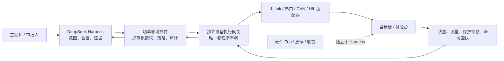
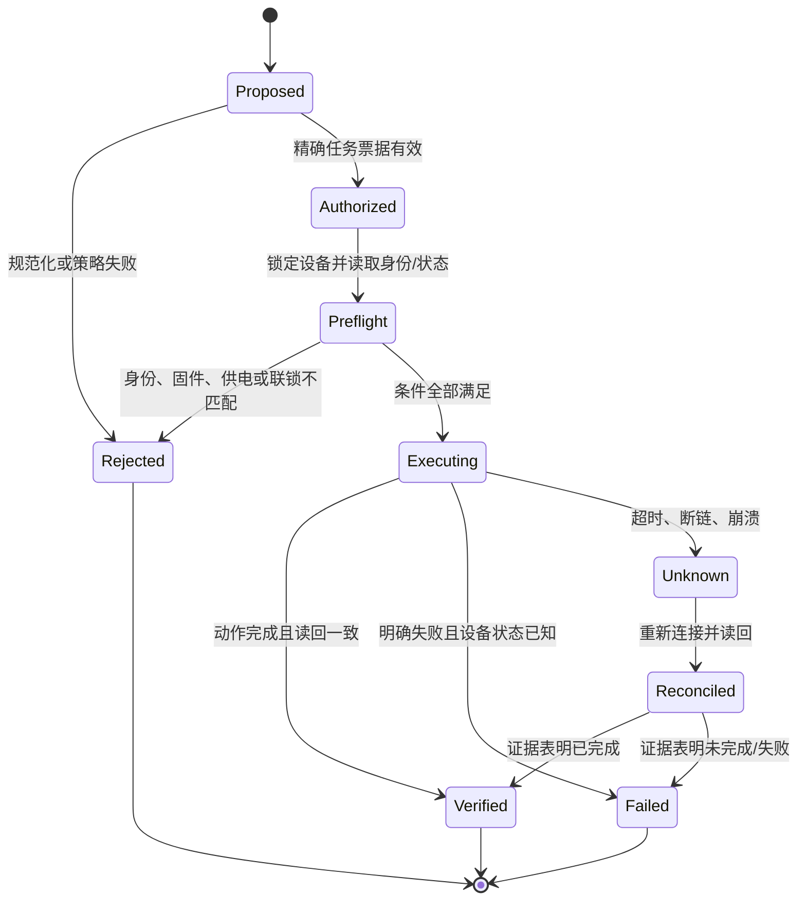

# 面向新能源功率软件工程师的 DeepSeek Harness 开发与使用指南

## 指南定位

DeepSeek Harness 可以成为光伏微逆、储能 PCS/BMS、充电、电源和微网项目的工程 Agent 编排层，用于源码分析、构建测试、日志与波形解析、文档追溯、仿真调度以及受控设备调试；它不能替代 MCU/DSP 上的实时控制、硬件保护、发波许可、接触器联锁或安全控制器。

本文基于[源码全面分析与解构](./deepseek-harness-source-analysis.md)给出行业落地边界、推荐架构、开发流程和验收清单。插件的通用实现方法见[可扩展性分析与插件开发指南](./plugin-extensibility-guide.md)。

本文没有获得任何真实目标板、固件、接口、电源条件或动作范围授权，因此所有设备操作内容均为设计与流程建议，不构成对目标芯片运行、烧录、清空 NVM、PWM、继电器、接触器、预充或真实母线动作的授权。

## 结论先行

【已验证事实】Harness 的 Agent Loop、工具和会话运行在 Node.js 与外部模型/工具链上，没有硬实时截止期保证；文件沙箱不覆盖 USB、J-Link、串口、网络和物理设备；取消信号不能证明外部动作停止；Schedule 和崩溃恢复不能提供物理动作 exactly-once。

因此，Harness 在功率系统中的正确角色是“意图、证据与工作流控制面”，而不是“物理执行所有者”。所有会改变设备真实状态的动作必须经独立设备网关执行，网关独占底层接口并自行验证目标身份、状态许可、授权票据、命令幂等性、结果读回与安全停止。

【工程判断】推荐从离线只读任务开始，逐级增加构建、仿真、目标只读和受控写入能力。真实发波、继电器/接触器、预充和母线相关动作不应作为普通模型工具直接暴露；若业务确需自动化，也应由经过认证的专用试验台控制器执行，Harness 只提交受限任务并接收可验证回执。

## 适合与不适合交给 Harness 的职责

| 类别 | 推荐职责 | 默认策略 |
| --- | --- | --- |
| 源码与设计 | 调用链、状态机、ISR、PWM-ADC 同步、PLL/MPPT/控制环、保护和 NVM 审查 | 允许只读；修改走代码评审和测试 |
| 构建与静态验证 | 编译、静态分析、单元测试、Map/反汇编分析、接口一致性检查 | 可在隔离工作区自动执行 |
| 数据分析 | 串口日志、示波器/逻辑分析仪导出、波形、故障记录、标定数据离线分析 | 原始证据只读，派生结果可写 |
| 仿真与 HIL | 模型运行、测试向量生成、结果比较、故障注入编排 | 优先使用模拟 Provider；物理 HIL 仍需台架边界 |
| 目标只读 | 读取芯片 ID、固件哈希、状态、保护锁存、只读寄存器、版本 | 任务级授权后，通过设备网关 |
| 目标写入 | 烧录、调参、写 NVM、复位、解锁、擦除 | 默认禁用；精确授权、前置读回、结果读回 |
| 功率动作 | PWM、继电器、接触器、预充、真实母线或功率源 | 不由普通 Harness 工具直接拥有 |
| 实时控制 | 电流/电压环、PLL、调制、保护响应、硬件 Trip | 必须留在 MCU/DSP/FPGA 或安全控制器 |

通信栈、上层业务、UI、通用 Agent 工具和非实时任务不得直接写 PWM、继电器或保护寄存器。底层驱动或控制模块必须有唯一物理执行所有者，其他层只提交逻辑命令。

## 推荐系统边界



Harness 只创建结构化操作请求并记录决策。领域插件把自然语言意图收敛为确定参数，设备网关负责真实执行。网关应是单独进程或受控服务，并把设备句柄、调试探针、串口和功率台架凭据从 Harness 进程移出。

硬件 Trip、急停、门极驱动关断、接触器互锁和预充状态机必须独立于模型、网络、Node 事件循环和会话持久化。软件控制链失效时，安全默认态仍应是停止发波、断开危险能量路径或维持项目定义的安全状态。

## 功能安全与保护不变量

以下规则应作为领域 Bundle 的固定策略、代码审查清单和设备网关合同，而不是只写在 Prompt 中：

1. 安全默认态：进程启动、插件未就绪、模型超时、网络断开、会话恢复和设备网关重启时，不自动产生新的物理动作。
2. 唯一发波授权：只有项目指定的控制模块或台架控制器能改变 PWM 许可；通信、UI、Agent 和通用脚本只能提出请求。
3. 硬件保护独立：过流、过压、驱动故障等硬件 Trip 不依赖 Harness 运行；软件不得为通过测试而屏蔽、放宽或自动清除锁存。
4. 故障优先：任何启动、调参或恢复命令都要让位于故障锁存和停机；恢复必须重新验证完整前置条件。
5. 目标身份固定：授权必须绑定开发板/台架唯一标识、固件哈希、接口和供电条件，不能只绑定“烧录”或“写寄存器”这个工具名。
6. 参数边界固定：死区、Trip、保护阈值、PWM 极性、ADC 采样点等安全参数变化必须在变更摘要首行单列旧值、新值、单位、依据与回退。
7. 动作一次一证：每个真实动作具有不可复用命令 ID、预状态快照、规范化参数、执行者、时间、结果和后状态读回。
8. 未知结果不重试：连接中断、超时或进程崩溃后，先读回设备状态；只有可证明只读或幂等的动作才自动重试。
9. 清空 NVM、保护配置变化、提高功率条件或更换目标板属于新的授权范围，不能沿用旧任务票据。
10. 人工与物理急停优先级最高，不能被插件、工作流、重试或恢复逻辑覆盖。

Prompt 可以提醒模型遵守这些规则，但 Prompt 不是强制边界。真正的拒绝逻辑必须位于工具 guard、领域服务和设备网关，且网关应在缺少任何字段时 fail closed。

## 权限分级与 Profile 设计

建议不要在一个 Standard Profile 中放入所有功率工具，而是按能力建立独立 Bundle/Profile，并让每次会话只获得所需最小集合。

| 级别 | 示例能力 | 推荐自动化程度 | 额外条件 |
| --- | --- | --- | --- |
| L0 离线只读 | 源码、手册、日志、波形读取 | 可自动 | 工作区 containment、无外部凭据 |
| L1 离线可写 | 代码/文档修改、构建、单测 | 可自动且可回滚 | Git diff、测试、禁止修改生成物 |
| L2 仿真/HIL 逻辑 | 启动仿真、加载测试向量、读取结果 | 可按任务自动 | 仿真进程隔离、超时、资源回收 |
| L3 目标只读 | 识别设备、读状态/锁存/版本 | 需任务级授权 | 固定目标、接口、供电条件、只读命令白名单 |
| L4 目标变更 | 烧录、复位、写配置/NVM | 每个动作精确审批 | 哈希、备份、前置状态、读回、回退镜像 |
| L5 功率动作 | PWM、继电器、接触器、预充、功率源 | 普通 Harness 默认不可用 | 专用台架、独立安全控制器、现场程序与人工确认 |

Minimal 模式不能作为 L0/L1 的安全实现，因为本地编辑器的 `cwd` 只是解析默认值，绝对路径和 `..` 可以越界。应使用真正执行 containment 的文件 Provider，或把 Harness 运行在 OS/容器级隔离环境中。

Code/PTC 与 Creator 模式应至少按 L1 全信任代码处理。它们适合可信工程师提高组合效率，不适合让不可信用户或未审计插件共享同一宿主。

## 领域服务缝设计

建议把功率能力拆成三个包层次：

- `power-device`：只定义类型、操作状态机、服务 Definition 和错误分类，不依赖 J-Link、串口、厂商 SDK 或上层工具。
- `power-device-provider-*`：分别实现 simulator、recording、J-Link、serial、CAN、HIL 等 Provider，独占真实连接生命周期。
- `tool-power-device`：把有限领域操作呈现为模型工具，依赖 Definition，不直接导入具体 Provider。

模拟 Provider 应先成为默认实现。它可以驱动绝大多数状态机、审批、会话、重复请求、超时和恢复测试，而不需要接真实硬件。

结构化请求必须完整描述“谁、对什么、在什么状态下、做什么、允许到什么边界”，而不是把一段自由文本直接传给底层脚本。下面是说明性合同，真实项目需使用仓库实际 API 和项目设备字段：

```ts ignore-check
type PowerOperation =
  | {
      kind: "read-status"
      targetId: string
      expectedFirmwareSha256: string
    }
  | {
      kind: "flash"
      targetId: string
      expectedFirmwareSha256: string
      imageSha256: string
      interfaceId: string
      powerConditionId: string
      authorizationId: string
      commandId: string
    }

type PowerReceipt = {
  commandId: string
  acceptedAt: string
  completedAt?: string
  outcome: "rejected" | "succeeded" | "failed" | "unknown"
  preStateHash: string
  postStateHash?: string
  evidenceRefs: readonly string[]
}
```

不要把密钥、完整固件、巨大波形或设备原始转储直接放入工具参数/结果和会话事件。应记录内容哈希、受控对象存储引用、大小、格式、采集条件和访问策略。

## 操作状态机

所有 L3 以上操作建议使用显式状态机，而不是在一个工具函数内串联脚本：



`Unknown` 不是 `Failed` 的同义词。Harness 的中断修复已经区分 `TOOL_NOT_STARTED` 与 `TOOL_OUTCOME_UNKNOWN`，领域插件应把相同原则延伸到设备网关，并禁止未知结果的自动写重试。

每次执行前应重新读取条件，不能只信会话中较早的状态。外部世界可能在模型思考、排队、审批或网络传输期间发生变化。

## 精确授权而不是“允许这个工具”

通用 user-approval 请求目前不携带完整工具参数，只含工具名、理由和 call ID。它适合一般交互，但不足以批准烧录、写 NVM 或设备动作。

领域授权票据至少应绑定：

- 操作者和审批者身份，以及票据有效期。
- 目标板、探针、端口和台架唯一标识。
- 当前固件哈希、待写镜像哈希和允许的版本迁移。
- 允许的操作种类、次数、参数范围和命令 ID。
- 电源、母线、负载、急停、联锁和测量条件的项目化标识。
- 允许擦除的精确区域，明确禁止清空额外 NVM。
- 失败后的安全状态、回退镜像和人工接管方法。

票据应由设备网关验证并消费，不能只由 Prompt 或 Harness UI 检查。一次票据不能跨目标板、跨固件、跨功率条件复用。

## PWM、ADC、控制环与保护代码的审查流程

第一步建立证据地图：从中断向量和调度入口定位 ISR/任务，追踪 PWM 写入、ADC 触发、保护 Trip、继电器/预充、控制状态机、配置来源、NVM 读取和通信命令的调用链。

第二步确认并发语义：列出执行频率、优先级、嵌套、共享变量、原子性、DMA、影子寄存器、全局加载点和看门狗关系。没有反汇编、周期计数器或实测时，不能给确定 WCET。

第三步确认控制不变量：采样点相对载波的位置、更新延迟、调制饱和、抗积分饱和、PLL 锁定许可、MPPT 与电流限幅仲裁、启动/停机/恢复、故障优先级和锁存清除条件。

第四步确认量纲与边界：所有标幺值、ADC counts、伏特、安培、欧姆、秒、赫兹、弧度和角度转换都要明确符号、比例和饱和边界。定点乘法还要检查 Q 格式、溢出、舍入和符号扩展。

第五步把结论分为【已验证事实】、【代码推断】、【工程判断】和【未知项】。例如“ISR 每 50 μs 执行”只有在定时器配置和时钟来源均已核对后才是已验证事实；“在当前编译优化下小于 20 μs”必须有反汇编或计数器测量。

## 实时性验收

对周期为 `T_s` 的控制任务，定义：

- `T_s`：控制周期，单位 s。
- `C_wcet`：最坏执行时间，单位 s，必须来自目标编译产物和目标芯片测量或可信上界分析。
- `J`：调度与中断抖动上界，单位 s。
- `M`：为保护响应、嵌套中断和未来变化保留的时间裕量，单位 s。

边界条件是同一目标芯片、时钟、编译器、优化、缓存/Flash 等待状态和中断配置。验收关系为 `C_wcet + J + M ≤ T_s`；等式两侧量纲均为秒。Harness 可以收集和比较证据，但不能从源码行数或 Node 侧耗时推导 `C_wcet`。

涉及 ISR、控制环或功率级时，应逐项记录：

- 执行频率、截止期、WCET 证据和裕量。
- 阻塞、锁、中断优先级/嵌套、原子性、重入和栈深。
- RAM/Flash 余量、缓存/等待状态、抖动和 DMA 竞争。
- PWM-ADC 同步点、影子寄存器、全局加载和死区。
- 看门狗、硬件 Trip 和软件保护的独立响应延迟。
- 启动、关机、故障恢复与低功率分阶段验证。

## 典型研发工作流

### 控制算法与 MPPT/PLL

先让 Agent 只读取控制模块、参数来源和测试，输出信号流、状态表、量纲表和未知项；再在离线仿真 Provider 中运行边界条件和故障注入；最后由工程师审查补丁和数值证据。模型不得根据经验自动修改增益、限幅或保护阈值并直接下发目标。

### PWM-ADC 同步与死区

从时钟树、PWM 计数模式、比较更新、ADC SOC、采样保持和 ISR 延迟建立完整时序。Harness 可生成采集计划和解析逻辑分析仪/示波器文件，但没有实测波形时不得声称同步相位、死区或无重叠已验证。

### 保护与故障恢复

用状态表列出故障来源、硬件/软件路径、优先级、锁存、关断动作、上报、清除许可和恢复条件。测试应覆盖同时故障、通信丢失、复位、棕断和持久化不完整；禁止为了通过测试放宽阈值或绕过联锁。

### NVM、标定与配置

区分运行 RAM、用户配置、校准数据、日志计数器和自适应参数。每类检查版本、CRC、原子更新、掉电恢复、磨损、默认值、迁移和回退。设备插件的“写配置”不能隐式擦除整片 NVM；擦除范围必须进入授权票据和回执。

### 编译、烧录与读回

构建产物先记录源码提交、工具链版本、编译选项、链接映射和镜像哈希。烧录前核对目标身份、现有固件、供电和授权；烧录后读取实际设备版本/哈希或项目规定的可验证标识。只有真实构建命令成功才能写“已编译”，只有目标读回成功才能写“已烧录并验证”。

## Harness 特有故障模式及对策

| Harness 行为 | 功率工程风险 | 领域对策 |
| --- | --- | --- |
| 会话 append-only，事件可能持久化失败 | 设备已动作但本地无完成记录 | 网关保存独立命令账本；按 command ID 对账 |
| 工具取消是协作式 | 子进程或设备动作继续 | 网关具备硬超时、kill/reconnect、停止和读回 |
| Schedule 存在重复窗口 | 写命令或试验重复 | 只调度幂等/只读任务；高风险任务使用一次性票据 |
| Code/PTC 副作用不回滚 | 组合调用中途失败留下半状态 | 把事务边界放在网关；提供显式补偿和 reconcile |
| 通用审批不含完整参数 | 审批人看不到目标和范围 | 参数级领域票据，UI 显示规范化差异 |
| Sandbox 主要约束文件 | 设备、网络、串口仍可访问 | OS/进程隔离；凭据和设备句柄仅在网关 |
| 遥测/会话记录原始工具数据 | 固件、密钥、设备标识泄露 | 哈希/引用替代大对象；字段脱敏与保留策略 |
| SQLite 同步、无竞争重试 | 长任务阻塞或写入失败 | 单写者队列、外置存储或压测后选型 |
| Preset 热重组保留旧代 | 旧连接/句柄长期存在 | Provider 单所有者、租约、重组时显式 quiesce |

## 证据与会话设计

会话日志适合作为 Agent 决策轨迹，但不应是唯一设备审计账本。设备网关应产生不可变回执，并让 Harness 事件只记录回执摘要和引用。

每份证据建议包含采集主体、目标标识、固件/配置哈希、时间源、单位、采样率、通道定义、仪器配置、原始文件哈希和转换脚本版本。波形截图本身不足以支持可重复结论。

工具输出应区分事实与解释：

- `measurement`：原始或可追溯测量值，带单位和误差/分辨率。
- `observation`：从测量直接得到的现象。
- `inference`：依据源码与测量的推论。
- `judgement`：工程取舍及其未验证前提。
- `unknown`：需要目标、手册或实测补齐的项目。

## 分阶段验证

1. 纯静态：读取源码、手册、原理图和既有数据，不连接设备。
2. 单元与模型：仿真 Provider、边界测试、故障注入、重复请求和崩溃恢复。
3. 构建与离线产物：真实工具链编译、静态分析、Map/反汇编和镜像哈希。
4. 目标只读：在明确任务授权下识别设备、读取状态和固件，不复位、不写入。
5. 逻辑级验证：项目批准的低风险供电条件下验证数字 IO、通信、PWM 关断态和保护输入；具体电压/功率条件由项目给出。
6. 低功率台架：独立安全控制器、限流、急停、隔离测量和人工监护，逐步开放动作。
7. 额定与异常：只按组织试验规程、风险评估和项目验收标准执行，不能由通用 Agent 自主扩展范围。

从一个阶段进入下一阶段必须重新确认目标、固件、接口、电源条件和允许动作。本文不提供任何项目的具体阈值、死区、母线电压或功率等级。

## 代码修改交付模板

普通控制代码修改应交付：变更摘要、涉及文件/函数、补丁、行为影响、验证结果、残余风险和回退方法。

若修改保护阈值、死区、Trip、安全默认态或启停不变量，变更摘要首行必须单列：

```text
安全参数变更：<参数>，旧值 <数值+单位>，新值 <数值+单位>，依据 <手册/计算/实测>，回退 <方法>
```

若未实际构建，应明确写“未编译验证”，列出阻塞项和已完成的静态检查。若未接目标和测量，应写“未实测”，不能用单元测试替代硬件结论。

## 项目落地验收清单

### 架构与所有权

- [ ] Harness、领域插件、设备网关、台架控制器和 MCU/DSP 的职责边界已画清。
- [ ] 每类物理信号只有一个最终执行所有者。
- [ ] 上层不能绕过领域服务直接访问寄存器、探针、串口或功率台架。
- [ ] 硬件 Trip、急停和联锁独立于 Harness。

### 授权与状态

- [ ] L3 以上动作需要任务级精确授权，且绑定目标、固件、接口和电源条件。
- [ ] 所有写动作具有不可复用 command ID、前置状态、结果读回和 unknown reconcile。
- [ ] 清空 NVM、保护变化、更换目标或提高风险等级会触发重新授权。
- [ ] 未知结果不会自动重试非幂等动作。

### 实时与控制

- [ ] ISR/任务频率、优先级、WCET、抖动、栈和内存证据齐全。
- [ ] PWM-ADC 同步、死区、影子加载、保护延迟和故障优先级已实测或明确标为未知。
- [ ] 启动、关机、故障、恢复和通信丢失路径具有状态表和测试。
- [ ] 数值公式、单位、标幺/定点转换和饱和边界经过审查。

### 数据、日志与秘密

- [ ] 会话日志与设备账本职责分开，回执可对账。
- [ ] 固件、密钥、校准数据和波形使用哈希/受控引用，不无界进入会话。
- [ ] 遥测默认关闭或有字段脱敏、访问、加密和保留策略。
- [ ] NVM 类型、版本、CRC、原子更新、磨损、迁移和回退已定义。

### 测试与回退

- [ ] 默认 Provider 是模拟/录制回放，真实 Provider 有同一合同测试。
- [ ] 覆盖断链、超时、重复请求、进程 kill、磁盘满和部分成功。
- [ ] 每个写操作有恢复或人工接管方案。
- [ ] 每次交付能从 Git diff、构建产物和设备回执追溯到同一任务。

## 关键 Harness 依据

- Turn 与会话写入顺序：[`agent-loop/src/agent.ts`](../../packages/core/agent-loop/src/agent.ts)
- 会话格式与未知事件规则：[`session/src/types.ts`](../../packages/core/session/src/types.ts)
- 工具执行、guard 与不可变结果：[`tools/src/index.ts`](../../packages/core/tools/src/index.ts)
- 通用审批边界：[`user-approval/src/index.ts`](../../packages/interaction/user-approval/src/index.ts)
- 文件沙箱策略：[`sandbox-policy/src/index.ts`](../../packages/sandbox/sandbox-policy/src/index.ts)
- Worker Thread 代码运行时：[`code-runtime-worker-thread/src/index.ts`](../../packages/code-runtime/code-runtime-worker-thread/src/index.ts)
- 会话持久化与恢复：[`session-persistence/src/index.ts`](../../packages/session/session-persistence/src/index.ts)
- JSONL 与 SQLite 后端：[`session-persistence-jsonl`](../../packages/session/session-persistence-jsonl/src/index.ts)、[`session-persistence-sqlite`](../../packages/session/session-persistence-sqlite/src/index.ts)
- 运行模式配置：[`standard`](../../apps/cli/config/agent-presets/standard/agent.cordis.yml)、[`code`](../../apps/cli/config/agent-presets/code/agent.cordis.yml)、[`minimal`](../../apps/cli/config/agent-presets/minimal/agent.cordis.yml)、[`cordis`](../../apps/cli/config/agent-presets/cordis/agent.cordis.yml)
